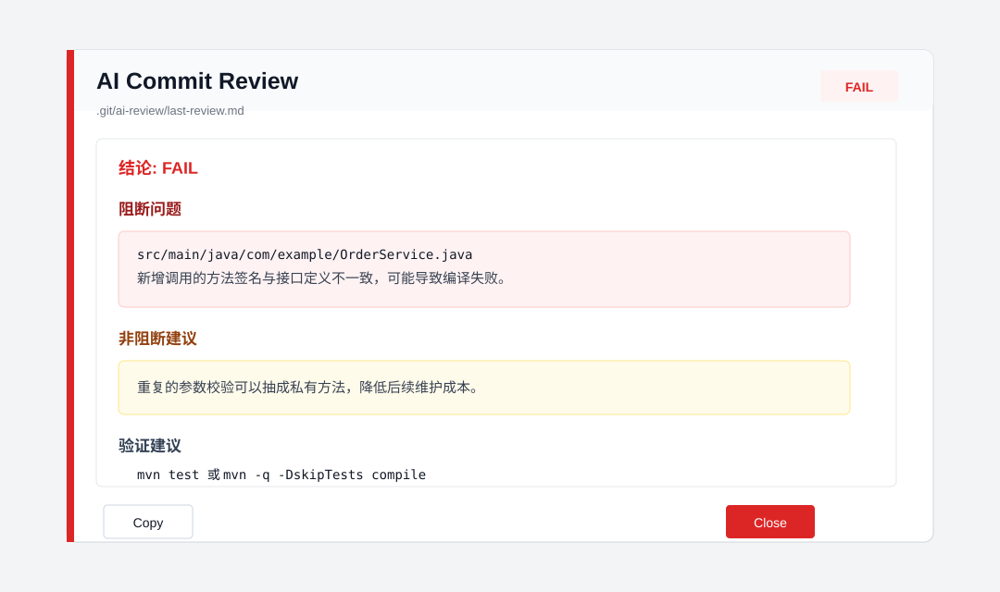
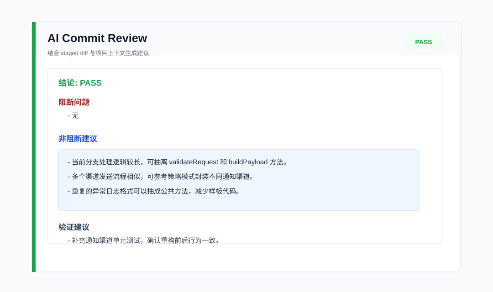
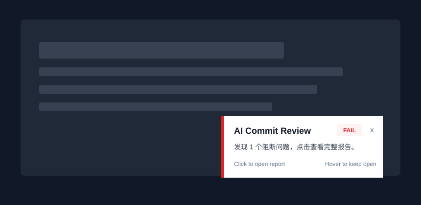

# AI Review Git Hook

一个可复用的 AI 代码审查 Git Hook。它会在 `git commit` 时读取本次暂存区 diff，异步调用 OpenAI 兼容接口做代码 review，并把结果写入本地日志，也可以通过邮件、企业微信或钉钉通知。

默认是异步执行：commit 会很快完成，AI review 和通知在后台继续运行。

## 功能特性

- 只审查 `git diff --cached`，也就是本次提交的暂存区代码。
- 支持 OpenAI-compatible `/v1/chat/completions` 接口。
- 默认不执行 Maven、Gradle、npm 等本地构建命令。
- 支持桌面通知、飞书、邮件、企业微信、钉钉通知。
- 邮件支持纯文本 + HTML 彩色格式。
- 默认不阻塞 commit；如果需要，也可以配置 AI 返回 `FAIL` 时阻止提交。
- 日志和报告写入 `.git/ai-review/`。
- 提供诊断脚本，检查 Git Bash、Python、AI API、SMTP 等环境。

## 功能效果展示

### 错误提示

AI 会把明显编译错误、运行时风险、数据一致性问题、安全风险等放到“阻断问题”里，并给出验证建议。



### 代码优化建议

非阻断建议会关注可维护性和重构方向，例如抽离公共方法、减少重复逻辑、简化啰嗦写法，或在合适场景下参考策略模式、模板方法、责任链等设计模式。



### 桌面通知

Windows 支持右下角原生小窗提示，鼠标悬停时不会自动消失，点击后打开内置报告窗口。



## 一键安装

默认安装到当前项目，只对当前仓库生效；在目标项目根目录执行。

Windows PowerShell：

```powershell
irm https://raw.githubusercontent.com/youqianHan/git-ai-review-hook/main/bootstrap.ps1 | iex
```

macOS / Linux：

```bash
curl -fsSL https://raw.githubusercontent.com/youqianHan/git-ai-review-hook/main/bootstrap.sh | sh
```

Gitee 镜像安装：

```powershell
$env:AI_REVIEW_HOOK_HOST="gitee"
$env:AI_REVIEW_HOOK_REPO="han_you_jin/git-ai-review-hook"
irm https://gitee.com/han_you_jin/git-ai-review-hook/raw/main/bootstrap.ps1 | iex
```

```bash
AI_REVIEW_HOOK_HOST=gitee AI_REVIEW_HOOK_REPO=han_you_jin/git-ai-review-hook \
curl -fsSL https://gitee.com/han_you_jin/git-ai-review-hook/raw/main/bootstrap.sh | sh
```

安装指定版本：

```bash
AI_REVIEW_HOOK_VERSION=v0.1.0 curl -fsSL https://raw.githubusercontent.com/youqianHan/git-ai-review-hook/main/bootstrap.sh | sh
```

Gitee 镜像不支持 GitHub 风格的 latest release 下载；当 `AI_REVIEW_HOOK_HOST=gitee` 且未指定版本时，脚本会下载当前内置的最新稳定版本。指定版本时使用：

```bash
AI_REVIEW_HOOK_HOST=gitee AI_REVIEW_HOOK_REPO=han_you_jin/git-ai-review-hook AI_REVIEW_HOOK_VERSION=v0.1.6 \
curl -fsSL https://gitee.com/han_you_jin/git-ai-review-hook/raw/main/bootstrap.sh | sh
```

全局安装，对当前用户的所有 Git 仓库生效：

```powershell
$env:AI_REVIEW_HOOK_SCOPE="global"
irm https://raw.githubusercontent.com/youqianHan/git-ai-review-hook/main/bootstrap.ps1 | iex
```

```bash
AI_REVIEW_HOOK_SCOPE=global curl -fsSL https://raw.githubusercontent.com/youqianHan/git-ai-review-hook/main/bootstrap.sh | sh
```

全局安装会把 hook 放到用户目录，并设置 `git config --global core.hooksPath`；配置写入 `~/.ai-review.env`。当前项目安装会设置当前仓库的 `core.hooksPath=githooks`，配置写入项目内 `.ai-review.env`。

本地 zip 测试：

```bash
AI_REVIEW_HOOK_ZIP=/path/to/git-ai-review-hook.zip sh bootstrap.sh
```

安装脚本会：

- 检查 Git、Git Bash、curl，以及 Git Bash 内可实际执行的 Python 3。
- 当前项目安装：设置 `git config core.hooksPath githooks`，并把 `.ai-review.env`、`/githooks/` 加入 `.gitignore`。
- 全局安装：设置 `git config --global core.hooksPath <用户目录下的 githooks>`。
- 交互式生成或更新本地配置文件。

## 手动安装

也可以手动复制 `githooks/` 到目标项目根目录，然后执行：

```powershell
.\githooks\install.ps1
```

或：

```bash
sh githooks/install.sh
```

## 配置

`.ai-review.env` 是本地配置文件，不要提交到仓库。

最小配置：

```bash
AI_REVIEW_ENABLED=true
AI_REVIEW_API_KEY=replace_with_your_api_key
AI_REVIEW_MODEL=gpt-5.5
AI_REVIEW_BASE_URL=https://example.com/v1
AI_REVIEW_ASYNC=true
```

默认会随 staged diff 发送少量相关项目上下文，帮助 AI 判断调用方、接口契约、Mapper/XML、配置和 DTO 等影响范围：

```bash
AI_REVIEW_CONTEXT_ENABLED=true
AI_REVIEW_CONTEXT_MAX_BYTES=80000
AI_REVIEW_CONTEXT_MAX_FILE_BYTES=20000
```

上下文会写入 `.git/ai-review/context.txt` 方便排障。它只用于辅助审查本次 diff；脚本会跳过 `.env`、密钥类文件、构建产物和二进制文件。

`AI_REVIEW_BASE_URL` 支持两种格式：

```bash
AI_REVIEW_BASE_URL=https://example.com/v1
AI_REVIEW_BASE_URL=https://example.com/v1/chat/completions
```

## 推荐通知方式

最简单的是桌面通知，不需要邮箱授权码或 webhook：

```bash
AI_REVIEW_DESKTOP_NOTIFY=true
AI_REVIEW_DESKTOP_NOTIFY_SECONDS=8
AI_REVIEW_DESKTOP_OPEN_MODE=native
AI_REVIEW_DESKTOP_AUTO_OPEN_REPORT=false
```

支持：

- macOS：`osascript` 系统通知；如设置 `AI_REVIEW_DESKTOP_AUTO_OPEN_REPORT=true`，review 完成后会自动弹出系统原生报告框
- Windows：PowerShell 自定义右下角通知，支持自动关闭、鼠标悬停暂停关闭，点击打开内置原生报告窗
- Linux：`notify-send`

`AI_REVIEW_DESKTOP_OPEN_MODE=file` 可恢复 Windows 点击后直接打开 `.git/ai-review/last-review.md` 文件的旧行为。

团队通知推荐飞书、企业微信或钉钉机器人，配置一个 webhook 即可。

## 飞书通知

```bash
AI_REVIEW_NOTIFY_ON=always
AI_REVIEW_FEISHU_WEBHOOK=https://open.feishu.cn/open-apis/bot/v2/hook/xxx
```

## 邮件通知示例

QQ 邮箱：

```bash
AI_REVIEW_NOTIFY_ON=always
AI_REVIEW_EMAIL_TO=dev@qq.com
AI_REVIEW_EMAIL_FROM=dev@qq.com
AI_REVIEW_SMTP_HOST=smtp.qq.com
AI_REVIEW_SMTP_PORT=465
AI_REVIEW_SMTP_USERNAME=dev@qq.com
AI_REVIEW_SMTP_PASSWORD=replace_with_smtp_auth_code
AI_REVIEW_SMTP_STARTTLS=false
AI_REVIEW_SMTP_SSL=true
```

163 邮箱：

```bash
AI_REVIEW_NOTIFY_ON=always
AI_REVIEW_EMAIL_TO=dev@163.com
AI_REVIEW_EMAIL_FROM=dev@163.com
AI_REVIEW_SMTP_HOST=smtp.163.com
AI_REVIEW_SMTP_PORT=465
AI_REVIEW_SMTP_USERNAME=dev@163.com
AI_REVIEW_SMTP_PASSWORD=replace_with_smtp_auth_code
AI_REVIEW_SMTP_STARTTLS=false
AI_REVIEW_SMTP_SSL=true
```

说明：

- `AI_REVIEW_SMTP_PASSWORD` 通常是邮箱 SMTP 授权码，不是网页登录密码。
- 465 端口通常使用 `AI_REVIEW_SMTP_SSL=true` 和 `AI_REVIEW_SMTP_STARTTLS=false`。

## 企业微信 / 钉钉

企业微信机器人：

```bash
AI_REVIEW_NOTIFY_ON=always
AI_REVIEW_WECHAT_WEBHOOK=https://qyapi.weixin.qq.com/cgi-bin/webhook/send?key=xxx
```

钉钉机器人：

```bash
AI_REVIEW_NOTIFY_ON=always
AI_REVIEW_DINGTALK_WEBHOOK=https://oapi.dingtalk.com/robot/send?access_token=xxx
```

通知触发模式：

```bash
AI_REVIEW_NOTIFY_ON=always  # 每次 review 成功或异常都通知
AI_REVIEW_NOTIFY_ON=fail    # 只有 AI 返回 FAIL 时通知
AI_REVIEW_NOTIFY_ON=error   # 只有 API 或响应异常时通知
AI_REVIEW_NOTIFY_ON=never   # 不通知
```

## 输出文件

```text
.git/ai-review/last-review.md
.git/ai-review/request.json
.git/ai-review/response.json
.git/ai-review/jobs/<job-id>/background.log
```

如果没收到通知，优先看最新 job 的 `background.log`。

Windows 上如果安装检测显示有 `python.exe`，但 commit 时 AI 调用失败，通常是 Microsoft Store 的 Python App Execution Alias 或 PATH 问题。安装脚本会实际执行 Python 3 代码，并确认它在 Git Bash 中可用；也支持 `py -3`。

## 诊断

运行完整诊断：

```powershell
powershell -NoProfile -ExecutionPolicy Bypass -File .\githooks\scripts\test-ai-review-env.ps1
```

不发送测试邮件：

```powershell
powershell -NoProfile -ExecutionPolicy Bypass -File .\githooks\scripts\test-ai-review-env.ps1 -SendMail false
```

只排查 Git Bash / Python / Hook 路径：

```powershell
powershell -NoProfile -ExecutionPolicy Bypass -File .\githooks\scripts\test-ai-review-env.ps1 -SendMail false -TestAi false
```

## 卸载

Windows：

```powershell
.\githooks\uninstall.ps1
```

macOS / Linux：

```bash
sh githooks/uninstall.sh
```

卸载脚本会移除：

```bash
git config core.hooksPath
```

但会保留本地 `githooks/` 和 `.ai-review.env`，如不再需要可手动删除。

## 安全说明

该工具会把本次暂存区 diff 发送给你配置的 AI 服务。使用前请确认你的团队允许把代码变更发送到该服务。

不要提交：

- `.ai-review.env`
- API Key
- SMTP 授权码
- 企业微信或钉钉 webhook

## English Summary

AI Review Git Hook reviews staged code changes during `git commit` and sends results through desktop notification, Feishu, email, WeCom, or DingTalk. It runs asynchronously by default, so commits return quickly while review and notifications continue in the background.

One-line install:

```powershell
irm https://raw.githubusercontent.com/youqianHan/git-ai-review-hook/main/bootstrap.ps1 | iex
```

```bash
curl -fsSL https://raw.githubusercontent.com/youqianHan/git-ai-review-hook/main/bootstrap.sh | sh
```

## Development

Run local checks:

```powershell
powershell -NoProfile -ExecutionPolicy Bypass -File .\tests\test-install.ps1
```

Build a release zip:

```powershell
powershell -NoProfile -ExecutionPolicy Bypass -File .\scripts\package-release.ps1
```

Shell syntax:

```bash
sh -n bootstrap.sh
sh -n githooks/install.sh
sh -n githooks/pre-commit
sh -n githooks/scripts/ai-review.sh
```
